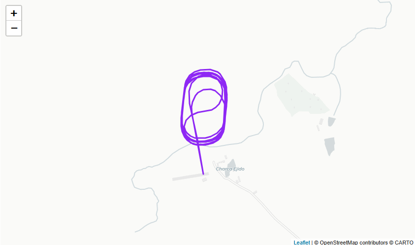
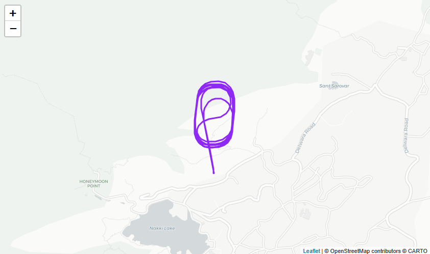

# GPS Relocation

These scripts relocate absolute GPS/global coordinates in PX4 and ArduPilot
logs. They preserve the shape of the path while moving the track to a fixed
inland synthetic origin.

## Why

Flight logs can reveal private test sites, customer locations, homes,
facilities, and operating routes. Running a local, inspectable tool before
upload gives users control over when raw location data leaves their machine.

This relocation approach is the safest option for privacy while keeping the log
useful for analysis: the original absolute location is replaced and is not
stored in the relocated file, so it cannot be reverse engineered from the
relocated log alone.

## Visual Example

The original log below contains a flight path near Trujillo, Extremadura,
Spain. After relocation, the same path shape appears near Mount Abu, Rajasthan,
India.

Original log:



Relocated log:



The loop shape and relative movement are preserved, while the original absolute
location is removed from the shared log.

## Requirements

- Python 3.10 or newer
- No external Python packages are required

The scripts use only the Python standard library.

Check Python:

```bash
python --version
```

On some Linux/macOS systems, use:

```bash
python3 --version
```

## Setup

Clone the repository:

```bash
git clone https://github.com/YARI-Robotics/flight-log-tools.git
cd flight-log-tools
```

Creating a virtual environment is optional because there are no third-party
dependencies, but it keeps the setup familiar and isolated.

### Windows PowerShell

```powershell
py -3 -m venv .venv
.\.venv\Scripts\Activate.ps1
python --version
```

If PowerShell blocks activation, run:

```powershell
Set-ExecutionPolicy -Scope CurrentUser RemoteSigned
```

### Ubuntu

```bash
sudo apt update
sudo apt install -y python3 python3-venv
python3 -m venv .venv
source .venv/bin/activate
python --version
```

### macOS

macOS usually includes Python, but installing a current version with Homebrew is
recommended:

```bash
brew install python
python3 -m venv .venv
source .venv/bin/activate
python --version
```

## Run PX4 Relocation

```powershell
python gps-relocation\relocate_px4_ulog.py C:\path\to\flight.ulg
```

On Ubuntu/macOS:

```bash
python gps-relocation/relocate_px4_ulog.py /path/to/flight.ulg
```

Output:

```text
flight-relocated.ulg
```

## Run ArduPilot Relocation

```powershell
python gps-relocation\relocate_ardupilot_bin.py C:\path\to\flight.BIN
```

On Ubuntu/macOS:

```bash
python gps-relocation/relocate_ardupilot_bin.py /path/to/flight.BIN
```

Output:

```text
flight-relocated.BIN
```

Use `--output` to choose a different destination file:

```bash
python gps-relocation/relocate_px4_ulog.py /path/to/flight.ulg --output /path/to/safe-flight.ulg
python gps-relocation/relocate_ardupilot_bin.py /path/to/flight.BIN --output /path/to/safe-flight.BIN
```

The scripts write only the relocated log file during normal use. They do not
create sidecar JSON files.

## Behavior

- The first valid coordinate becomes the source anchor.
- Later absolute coordinates keep their relative north/east offset from that anchor.
- Absolute altitude fields are shifted so the anchor sits near the destination ground elevation.
- The original file is not modified.
- The user is responsible for choosing an appropriate synthetic origin before running the script.
